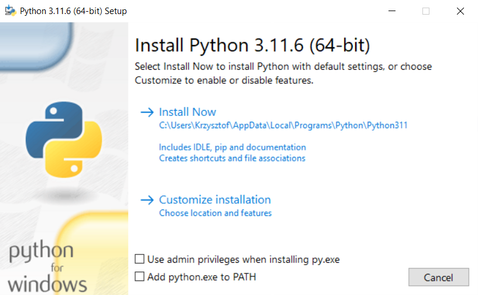
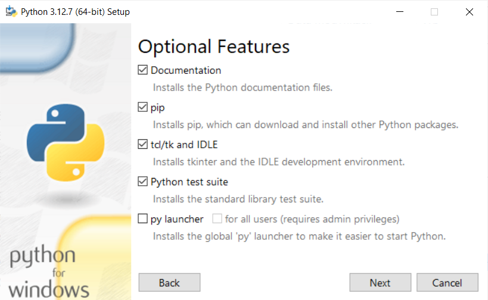
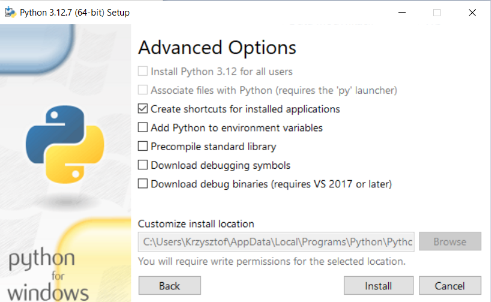
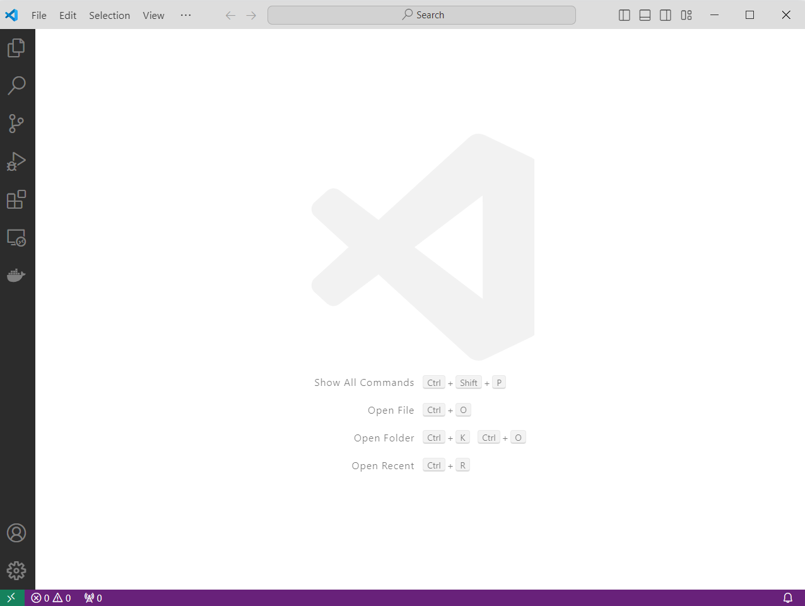
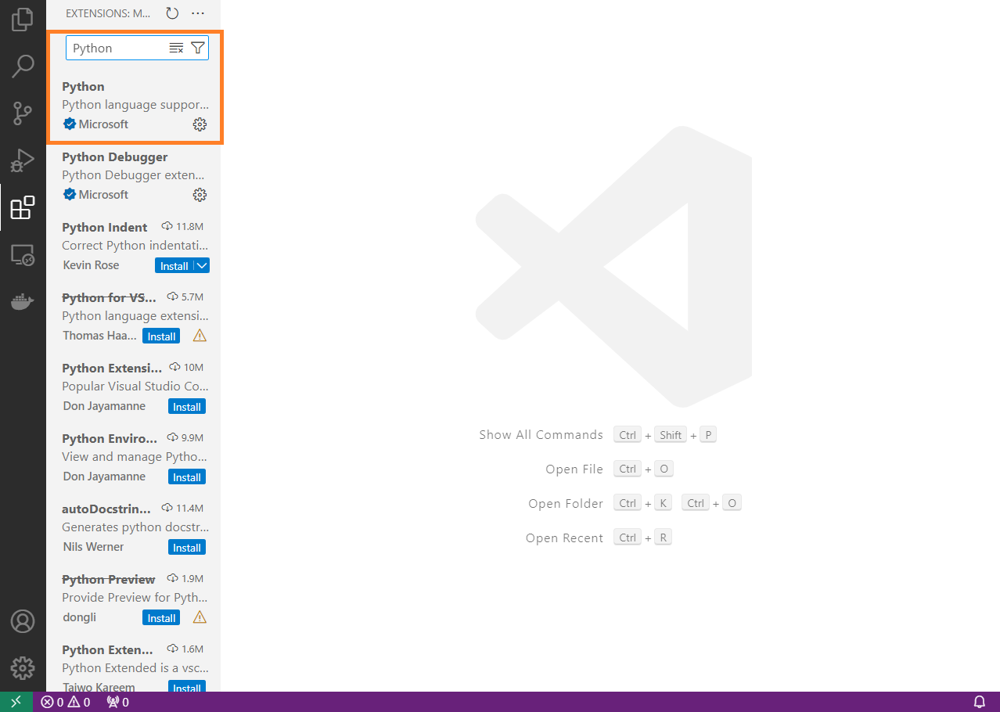

# Moduł 0 - przygotowanie środowiska pracy


## 1. Niezbędne oprogramowanie

### 1.1 IDE - zintegrowane środowisko developerskie

Najbardziej popularnym rozwiązaniem do pracy z językiem Python jest obecnie oprogramowanie **PyCharm IDE od firmy JetBrains**. Dostępne jest w dwóch wariantach:
* **PyCharm Community** - rozwiązanie darmowe.
* **PyCharm Professional** - rozwiązanie płatne (dostępne również w ramach licencji akademickiej, przedłużanej co rok, bez zastosowań komercyjnych).

Różnice między obiema wersjami można znaleźć tu: https://www.jetbrains.com/products/compare/?product=pycharm-ce&product=pycharm

Innym bardzo popularnym rozwiązaniem jest **Visual Studio Code** (w skrócie VSC) firmy Microsoft, które jest narzędziem w pełni darmowym. Jest to uniwersalne narzędzie pozwalające na rozbudowywanie jego możliwości poprzez szereg pluginów. Jednym z najbardziej popularnych jest ten umożliwiający pracę z językiem Python.

### 1.2 Interpreter języka Python

Narzędzie do wspierania procesu wytwarzania oprogramowania (IDE) jest niezwykle pomocne i podnosi produktywność, ale interpreter języka Python będzie nam niezbędny, aby uruchomić nawet najprostszy kod.

Interpreter pobieramy z oficjalnej strony: https://www.python.org/ z sekcji `Downloads`. W trakcie zajęć wykorzystywana będzie **wersja 3.12.7** najbardziej popularnej implementacji, czyli **CPython (implementacja w języku C)**.

Proces instalacji i konfiguracji zostanie przedstawiony w trakcie zajęć.

### 1.3 Instalacja oprogramowania

Oprogramowanie Pycharm pobieramy z adresu https://www.jetbrains.com/pycharm/download/?section=windows, a jego instalacja nie należy do skomplikowanych, więc kolejne zazwyczaj polegają na przeklikaniu przez kolejne kroki instalatora.

Jako, że Visual Studio Code jest bardzo popularnym narzędziem do pracy z wieloma różnymi technologiami (np. C++, C#, mardown, Latex, Python i inne), a konfiguracja na potrzeby pracy z językiem Python jest nieco bardziej złożona niż w przypadku narzędzia PyCharm, ten proces został również opisany w dalszej części tej sekcji.

**Krok 1** – instalacja interpretera języka Python. 
Na stronie https://www.python.org/ przechodzimy do podstrony Downloads i odnajdujemy wersję 3.12.7. (https://www.python.org/downloads/release/python-3127/). Następnie w części **Files** (na dole strony) odnajdujemy paczkę dla naszego systemu operacyjnego. Jeżeli nie jesteśmy pewni czy dysponujemy wersją 32 czy 64-bitową systemu operacyjnego, można to sprawdzić wybierając z menu kontekstowego (prawy przycisk myszy) opcję 'Właściwości' na ikonie Ten komputer (lub Mój komputer) w przypadku systemu Windows. Dla wersji 64-bit właściwą paczką dla systemu Windows będzie `Windows x86-64 executable installer`, a dla 32-bitowej `Windows x86 executable installer`.

Uruchomienie pobranego pliku w systemie Windows skutkuje pojawieniem się okna podobnego do poniższego (tu dla starszej wersji) jeżeli wersja 3.12.* nie jest już zainstalowana w systemie.


 
Jeżeli jest to jedyny interpreter języka Python w naszym systemie, możemy dodać interpreter do ścieżki systemowej (zmienna środowiskowa **PATH**). Spowoduje to możliwość korzystania z interpretera nie tylko bezpośrednio z folderu, do którego został zainstalowany. Zaznaczamy więc checkbox _**„Add python.exe to PATH”**_.

W przypadku gdy w naszym systemie jest już zainstalowany interpreter Pythona w tej głównej wersji (czyli 3.12.* gdzie * oznacza dowolną liczbę) i instalator to wykryje, pojawi się okno podobne do poniższego.


Jeżeli chcemy zainstalować interpreter w domyślnej zaproponowanej lokalizacji, wybieramy opcję **„Install Now”**. Jeżeli chcemy wybrać inną ścieżkę i zobaczyć dodatkowe opcje wybieramy **„Customize installation”**. Poniżej podgląd okna z wyborem opcji do zainstalowania.



Wybranie opcji **pip** zainstaluje menadżera pakietów Pythona, którym możemy doinstalować w wygodny sposób pakiety, które nie wchodzą w skład biblioteki standardowej. Opcja **tcl/tk and IDLE** nie jest de facto niezbędna na naszych zajęciach, ale okazuje się, że niektóre pakiety pobierane z publicznego repozytorium wymagają pakietu tcl, a jego ręczna instalacja bywa kłopotliwa. IDLE jest prostym oprogramowaniem typu IDE do uruchamiania kodu Pythona w sposób interaktywny lub poprzez skrypty. **Python test suite** instaluje pakiety niezbędne do pisania testów i nie będzie nam w tym kursie potrzebny, ale może przydać się w dalszej przygodzie z nauką języka. Nowsze wersje interpretera Pythona 3 dostarczają narzędzie **py launcher**, które pozwala na uruchamianie różnych wersji interpretera, jeżeli są zainstalowane. Dotyczy systemu Windows. Więcej informacji można znaleźć w oficjalnej dokumentacji pod linkiem: https://docs.python.org/3/using/windows.html

Wybranie **„Next”** wyświetli poniższe okno, gdzie możemy wybrać inną ścieżkę instalacji.



---
**Krok 2 (opcjonalny)** – pobieramy i instalujemy Visual Studio Code ze strony https://code.visualstudio.com/. W zależności od platformy (Windows, macOS, Linux) wybieramy odpowiednią paczkę*.

\* proces instalacji na innych niż Windows platformach będzie się nieco różnił.

**Krok 3** – Instalacja plug-inu.
Uruchamiamy Visual Studio Code (przykładowe okno poniżej) i wybieramy po lewej stronie ikonę _**Extensions**_. 

 
 
Wyszukujemy frazę „Python” i na odpowiednim elemencie z listy wybieramy _**Install**_ (na screenie poniżej plug-in jest już zainstalowany).
 


To już prawie wszystko, aby móc pracować z językiem Python z wykorzystaniem Visual Studio Code. Szczegóły i dodatkowe możliwości narzędzia zostaną zaprezentowane podczas zajęć.

**Warto mieć pod ręką**

Aby poprawiać produktywność warto przyswajać sukcesywnie skróty klawiaturowe.
Skróty dla VSC w zwięzłej formie można znaleźć pod adresem: https://code.visualstudio.com/shortcuts/keyboard-shortcuts-windows.pdf

A dla oprogramowania PyCharm tutaj: https://resources.jetbrains.com/storage/products/pycharm/docs/PyCharm_ReferenceCard.pdf

## 2. Konfiguracja środowiska wirtualnego Pythona na potrzeby projektu.

Po zainstalowaniu interpretera języka Python mamy do dyspozycji wszystkie standardowe moduły, które dają nam już sporo możliwości, ale to poprzez możliwość wykorzystywania zewnętrznych modułów/bibliotek znacznie poszerzamy jego możliwości. Instalowanie tych rozszerzeń odbywa się do podfolderu `Lib\site-packages`. 

Rozważmy sytuację, w której potrzebujemy różnych rozszerzeń dla różnych projektów, lub co gorsza tych samych rozszerzeń w różnych wersjach. Instalowanie kilku wersji tego samego rozszerzenia w różnych wersjach dla tego samego folderu instalacyjnego interpretera Pythona nie jest możliwe. Musimy istniejącą wersję rozszerzenia/biblioteki najpierw odinstalować.

Rozwiązaniem, które pozwala nam uniknąć takiej sytuacji jest możliwość tworzenia wirtualnych środowisk interpretera Pythona dla poszczególnych projektów, które spowodują utworzenie kopii interpretera pythona i podstawowych narzędzi we wskazanym folderze, ale bez zainstalowanych rozszerzeń z głównego folderu interpretera pozwalając na stworzenie oddzielnej przestrzeni na te rozszerzenia dla danego projektu.

Aktualnie istnieje wiele narzędzi pozwalających na tworzenie takich środowisk takie jak moduł Pythona `virtualenv`, narzędzie `pyenv`, `conda`, `poetry` i inne. PyCharm oraz VSC posiadają również integrację z tymi narzędziami pozwalając nieco uprościć ten proces.

`Virtualenv` jest pakietem Pythona więc aby z niego skorzystać należy upewnić się, że stosowny pakiet jest zainstalowany i ewentualnie go zainstalować za pomocą pakietu pip jak pokazano poniżej:

```console
python -m pip install virtualenv

# jeżeli narzędzie pip jest również dodane do zmiennej środowiskowej
# to wystarczy

pip install virtualenv

# w przypadku systemu linux i macOs możliwa konieczność
# wykonania polecenia w sposób poniższy

python3 -m pip install virtualenv
# lub
pip3 install virtualenv
```

Aby stworzyć nowe środowisko wirtualne należy wskazać folder, w którym takie środowisko chcemy stworzyć. Następnie wykonanie komendy:

```console
python -m virtualenv nazwa_srodowiska
```

To polecenie spowoduje stworzenie nowego folderu o nazwie `nazwa_srodowiska` w bieżącym folderze (zamiast tylko nazwy możemy podać ścieżkę, w której ten folder ma zostac stworzony) i skopiuje interpreter Pythona, który jest aktualnie obowiązującym dla uruchomionego modułu `virtualenv`. Dołączone zostaną też skrypty pozwalające m.in. na aktywację i deaktywację środowiska wirtualnego.

Kolejną czynnością, którą trzeba wykonać, aby rozpocząć pracę w tym środowisku, jest jego aktywacja, która polega na uruchomieniu skryptu z pliku `Scripts\activate` znajdującego się w folderze nowego środowiska. Od teraz aktywnym interpreterem jest ten zawarty w nowym środowisku. Możemy teraz uruchamiać skrypty Pythona, instalować pakiety oraz korzystać z konsoli Python w odniesieniu do tego środowiska.

Na zajęciach na podstawie dokumentacji ze strony https://virtualenv.pypa.io/en/stable/user_guide.html zostanie zaprezentowany sposób konfiguracji i korzystania ze środowiska wirtualnego.

Instrukcja stworzenia środowiska wirtualnego z wykorzystaniem Visual Studio Code znajduje się pod adresem: https://code.visualstudio.com/docs/python/environments


