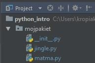

# Moduł 5 - Python comprehensions. Pisanie własnych funkcji.


## 1.Python comprehensions.

Jest to mechanizm służący do generowania kolekcji (lista, słownik, zbiór, krotka) na podstawie jednowierszowej definicji. Równoważne definicje zawsze można podać za pomocą pętli. Czasami zaś wystarczy przepisać na język Python definicję matematyczną zbioru.

**Listing 1**

```python
# zamiast pisać w pętli
lista = []
for element in range(5):
    if element > 0:
        lista.append(element * element)

# możemy zapisać w jednej linijce
lista = [element * element for element in range(5) if element > 0]
```

Mamy zdefiniowane zbiory:

A={x^2: x&isin;<0,9>}  
B={1, 3, 9, 27,…, 3^5}  
C={x: x&isin;A i x jest liczbą nieparzystą}  

W Python zapiszemy to:

**Listing 2**

```python
A = [x ** 2 for x in range(10)]
B = [3 ** i for i in range(6)]
C = [x for x in A if x % 2 != 0]

print(A)
print(B)
print(C)
```

**Listing 3**

```python
# chcemy uzyskać liczby parzyste z podanego zakresu
# wersja z pętlą
liczby = [1, 2, 3, 4, 5, 6, 7, 8, 9, 10]
lista = []

for i in liczby:
    if i % 2 == 0:
        lista.append(i)

print("Liczby parzyste uzyskane z wykorystaniem pętli")
print(lista)

# wersja z Python comprehension
lista2 = [i for i in liczby if i % 2 == 0]
print(lista2)
```

**Listing 4**

```python
# zagnieżdżanie
# zamiast pisać tak:
lista = []
for i in [1, 2, 3]:
   for j in [4, 5, 6]:
      if i != j:
          lista.append((i,j))
print(lista)

# można to zrobić krócej
lista2 = [(i,j) for i in [1, 2, 3] for j in [4, 5, 6] if i != j]
print(lista2)
```

**Listing 5**

```python
# słowniki i zamiana klucza z wartością
skroty = {"PZU": "Państwowy zakład Ubezpieczeń",
"ZUS": "Zakład Ubezpieczeń Społecznych",
"PKO": "Powszechna Kasa Oszczędności"}
odwrocone = {value: key for key, value in skroty.items()}

print("Oryginalny słownik")
print(skroty)
print("Słownik odwrócony")
print(odwrocone)
```

**Zadanie 1**  

Zdefiniuj następujące zbiory, wykorzystując Python comprehension:  
A={1/x: x&isin;<1,10>}  
B={1, 2, 4, 8,…, $2^{10}$}  
C={x: x&isin; B i x jest liczbą podzielną przez 4}  

**Zadanie 2**

Wygeneruj macierz (lista dwupoziomowa) losowych wartości (sprawdź pakiet **[random](https://docs.python.org/3.12/library/random.html)**)  o rozmiarach 4x4 i wykorzystując Python Comprehension zdefiniuj zmienną typu `list`, która będzie zawierała tylko elementy znajdujące się na przekątnej tej macierzy.

**Zadanie 3**

Utwórz słownik z produktami spożywczymi do kupienia. Klucz to niech będzie nazwa produktu a wartość - jednostka w jakiej się je kupuje (np. sztuki, kg itd.). Wykorzystaj Python Comprehension do zdefiniowania nowej listy, gdzie będą tylko te produkty, których wartość to sztuki.

Mechanizm przedstawiony w tym podrozdziale jest bardzo przydatny, chociaż skomplikowane polecenia
mogą być wyzwaniem do zinterpretowania względem „tradycyjnego” podejścia. Więcej przykładów można
znaleźć w dokumentacji Pythona pod adresem https://docs.python.org/3.12/tutorial/datastructures.html#nested-list-comprehensions

## 2. Definiowanie własnych funkcji.

Ogólna definicja funkcji mówi, że jest to wydzielony blok kodu, który ma robić możliwie jak najmniej
rzeczy na raz, ale ma to robić dobrze. Jest to też niezbędny element metodologii DRY (Don’t Repeat Yourself), czyli tam, gdzie jakaś funkcjonalność będzie wykorzystywana wielokrotnie, możemy zastosować funkcję.


**Listing 6**
```python

def nazwa_funkcji(arg_pozycyjny, arg_domyslny=wartosc, *arg_4, **arg_5):
    instrukcje
    ...
    [ return wartość ] # opcjonalne
```

Funkcję możemy wywoływać z argumentami lub bez, ale zawsze musimy używać nawiasów (nawet jak nie ma argumentów, wtedy nazywamy ją funkcją bezargumentową). Funkcja może nie zwracać żadnej wartości, może zwracać jedną lub wiele wartości, a w tym ostatnim przypadku wartości będą zwrócone jako krotka (ang. tuple).

**Listing 7**

Chcemy zdefiniować funkcję, która będzie obliczać pierwiastki równania kwadratowego:
```python
import math


def row_kwadratowe(a, b, c):
    delta = b**2 - 4 * a * c
    if (delta < 0):
        print("Brak pierwiastków")
        return -1
    elif (delta == 0):
        print("Jeden pierwiastek")
        x = (-b) / (2 * a)
        return x
    else:
        print("Równanie ma dwa pierwiastki")
        x1 = (- b - math.sqrt(delta)) / (2 * a)
        x2 = (- b + math.sqrt(delta)) / (2 * a)
        return x1, x2

print(row_kwadratowe(6,1,3))
print(row_kwadratowe(1,2,1))
print(row_kwadratowe(1,4,1))
```


**Listing 8**
```python
# definiujemy funkcje z wartościami domyślnymi
import math


def dlugosc_odcinka(x1 = 0, y1 = 0, x2 = 0, y2 = 0):
    return math.sqrt((x2 - x1)**2 + (y2 - y1)**2)


# wywołujemy dla wartości domyślnych
print(dlugosc_odcinka())

# wywołujemy dla własnych podanych wartości
# są to argumenty pozycjne czyli ważna jest kolejnosć podania wartości
print(dlugosc_odcinka(1, 2, 3, 4))

# wywołujemy funkcje podając mieszane wartości
# dwie pierwsze są interpretowane jako x1 i y1 jak podano w definicji funkcji
print(dlugosc_odcinka(2, 2, y2 = 2, x2 = 1))

# wywołujemy funkcje pdoając wartości nie w kolejności
print(dlugosc_odcinka(y2 = 5, x1 = 2, y1 = 2, x2 = 6))

# wywołujemy funkcję podając tylko dwa argumenty a reszta domyślne
print(dlugosc_odcinka(x2 = 5, y2 = 5))
```


**Zadanie 4**

Zdefiniuj funkcję, która "pyta" użytkownika o jego imię i po jego podaniu wyświetla komunikat 'Witaj {imie}!'.

**Zadanie 5**  
Napisz funkcję, która przyjmuje jeden argument pozycyjny, o domyślnej wartości 4, i na podstawie tego argumentu wypisuje na wyjściu (konsola) n*n tych wartości, np.: dla liczby 3:
```python
333
333
333
```

**Listing 9**
```python
# symbol * oznacza dowolną ilość argumentów przechowywanych w krotce
def ciag(* liczby):
    # jeżeli nie ma argumentów to
    if len(liczby) == 0:
        return 0.0
    else:
        suma = 0.0
    # sumujemy elementy ciągu
    for i in liczby:
        suma += i
    # zwracamy wartość sumy
    return suma

# wywołanie gdy brak argumentów
print(ciag())
# podajemy argumenty
print(ciag(1,2,3,4,5,6,7,8))
```
**Zadanie 6**

Wykorzystując poprzedni przykład zdefiniuj funkcję, która będzie liczyć iloczyn elementów ciągu.

**Listing 10**
```python
# symbol ** czyli oznacza, że możemy przekazać do funkcji
# dowolną ilość argumentów z kluczem
def to_lubie(** rzeczy):
    for cos in rzeczy:
        print(f'Lubię {cos}', end='')
        if len(rzeczy[cos]) > 0:
            print(f', takie jak {rzeczy[cos]}.')

to_lubie(slodycze="czekolada", rozrywka=["disco-polo", "moda na sukces"])
```
**Zadanie 7**

Napisz funkcję, która wykorzystuje symbol **. Funkcja przyjmuje argumenty w postaci: klucz to nazwa drużyny a wartość to ilość punktów, które drużyna zdobyła. Funkcja zlicza ile jest wszystkich punktów razem i zwraca tę wartość.

## 3. Moduły i pakiety.

W środowisku Python moduł to po prostu pojedynczy plik z kodem Pythona, który możemy stworzyć i zapisać. Pakiet to zbiór takich modułów a najczęściej oznacza folder, w którym znajdują się pliki (moduły). Oba te elementy można importować na różne sposoby (przykłady poniżej).
Zawartość modułu może być zbiorem funkcji lub klas i metod. Taki moduł możemy następnie po zaimportowaniu wykorzystywać w innych naszych programach, modułach lub pakietach. Poniżej prosty przykład modułu i jego wykorzystania w innym skrypcie.

**Listing 11**
```python
# plik matma.py
"""deklaracja funkcji w prostym module"""


def dodaj(a, b):
    return a + b


def odejmij(a, b):
    return a - b


def podziel(a, b):
    return a / b


def pomnoz(a, b):
    return a * b
```

Teraz możemy z poziomu innego pliku w tym samym folderze zaimportować ten moduł.

**Listing 12**
```python
import matma


print(matma.dodaj(1, 2))
print(dir(mojpakiet))
print(dir(mojpakiet.matma))
```

Moduły najczęściej importują inne moduły a te importują kolejne. Jeżeli w trakcie tego procesu zostanie napotkany zduplikowany import to zostanie on zignorowany. Polecenie `dir(modul|pakiet)` wyświetla wszystkie zmienne oraz nazwy modułów, które się w nich znajdują.

Aby stworzyć pakiet trzeba jeszcze dodać specjalny plik do folderu (pakietu) o nazwie `__init__.py`. Jeżeli korzystamy z zalecanego sposobu importu modułów czyli import pakiet.moduł to możemy jego zawartość
pozostawić pustą chociaż może się tam również znajdować kod inicjalizujący dla pakietu. Natomiast jeżeli chcemy umożliwić import z tego pakietu za pomocą `from pakiet import *` to plik `__init__.py` powinien zawierać zmienną `__all__` zawierającą listę modułów, które będą zaimportowane:

```python
__all__ = ['matma', 'jingle']
```


Aby sprawdzić sposób działania poniższych listingów przedstawię najpierw strukturę katalogów i plików, które zostały wykorzystane w poniższych przykładach.



Reasumując, został utworzony folder `mojpakiet` a w nim znajduje się plik `matma.py` przedstawiony na listingu w tym rozdziale.

Zawartość pliku `jingle.py`:

**Listing 13**
```python
__all__ = ['sing'] 


def sing(): 
    return 'Jingle bells, jingle bells...' 


def snow(): 
    return 'It's snowing...'
```

Plik, który wykonuje same importy na tym pakiecie znajduje się w tym samym folderze co pakiet. A jego zawartość to:

**Listing 14**
```python
from mojpakiet import * 


print(matma.dodaj(1, 2)) 
print(jingle.sing())
```

Zmienna `__all__` służy również do określania listy funkcji w module. Zmienna jest wtedy umieszczana w pliku z definicją klas/funkcji a jej postać jest taka sama jak w przypadku pakietu z taką różnicą, że po zaimportowaniu takiego modułu (pliku) wszystkie jego funkcje i tak będą widoczne bez względu na to czy znalazły się w zmiennej `__all__` czy też nie. Określanie `__all__` w module najczęściej wykorzystywane jest po to,
aby mieć dostęp do listy klas, metod danego modułu np. po to, aby sprawdzić jakie funkcje możemy wywołać.


Więcej informacji można znaleźć pod adresem https://docs.python.org/3/tutorial/modules.html


Podsumowując, zalecanym sposobem wykonywania importów jest 
`from pakiet import moduł`,
`import moduł` lub
`import moduł as alias`.

Jako ciekawostkę polecam umieszczenie polecenia `import this` w swoim pliku lub wykonanie w konsoli.
